<h1 align="center"> Learning Using Privileged Information for Object Detection </h1>

<p align="center">
  This repository contains <strong>LUPI-OD</strong>, the first method to apply Learning Using Privileged Information <strong>(LUPI)</strong> to Object Detection <strong>(OD)</strong>. It improves performance without increasing model size, making it ideal for applications that demand lightweight, efficient solutions.
</p>

<p align="center">
  <!-- Language & License -->
  <a href="https://www.python.org/downloads/">
    
  </a>
  <a href="https://opensource.org/licenses/MIT">
    
  </a>
</p>

<!-- <p align="center" style="margin-bottom: 1em;">
  <strong>
    To validate its effectiveness, LUPI-OD has been tested extensively on diverse datasets and popular object detection models:
  </strong>
</p> -->

<!-- Datasets Section -->
<p align="center" style="font-weight: bold; font-size: 1.1em; margin-top: 1.5em; margin-bottom: 0.5em;">
  Datasets Used for Evaluation:
</p>
<p align="center">
  <a href="https://universe.roboflow.com/bottles-in-the-wild" target="_blank" style="text-decoration:none;">
    
  </a>
  <a href="https://universe.roboflow.com/mcast/uavvaste-avcle" target="_blank" style="text-decoration:none;">
    
  </a>
  <a href="https://universe.roboflow.com/soda-dataset/" target="_blank" style="text-decoration:none;">
    
  </a>
  <a href="https://public.roboflow.com/object-detection/pascal-voc-2012/1" target="_blank" style="text-decoration:none;">
    
  </a>
</p>

<!-- Models Section -->
<p align="center" style="font-weight: bold; font-size: 1.1em; margin-top: 1.5em; margin-bottom: 0.5em;">
  Popular Object Detection Models Used:
</p>
<p align="center">
  <!-- Model Badges with Papers With Code links and distinct colors -->
  <a href="https://paperswithcode.com/method/faster-r-cnn" target="_blank" style="text-decoration:none;">
    
  </a>
  <a href="https://paperswithcode.com/method/ssd" target="_blank" style="text-decoration:none;">
    
  </a>
  <a href="https://paperswithcode.com/method/retinanet" target="_blank" style="text-decoration:none;">
    
  </a>
  <a href="https://paperswithcode.com/paper/mobilenetv2-inverted-residuals-and-linear" target="_blank" style="text-decoration:none;">
    
  </a>
  <a href="https://paperswithcode.com/method/fcos" target="_blank" style="text-decoration:none;">
    
  </a>
</p>


## 📚 Table of Contents
<details>
<summary style="cursor: pointer;"><b>Click-to-View</b></summary>

- [� Table of Contents](#-table-of-contents)
- [📄 Abstract](#-abstract)
- [⚙️ LUPI-OD Architecture](#️-lupi-od-architecture)
- [🧪 Methodology](#-methodology)
- [🎯 Contributions of This Research](#-contributions-of-this-research)
- [📈 Main Detection Results](#-main-detection-results)
  - [🧮 Model Size Comparison on Pascal VOC 2012](#-model-size-comparison-on-pascal-voc-2012)
- [🔍 Other Detection Results](#-other-detection-results)
  - [🛠️ Preliminary Experiment for Privileged Information Selection](#️-preliminary-experiment-for-privileged-information-selection)
  - [📊 Teacher Model Performance on Pascal VOC 2012](#-teacher-model-performance-on-pascal-voc-2012)
- [💾 Installation](#-installation)
  - [Prerequisites](#prerequisites)
  - [Clone the Repository](#clone-the-repository)
- [🎓 About This Research](#-about-this-research)
  - [🎓 Dissertation](#-dissertation)
- [🪪 License](#-license)
- [✉️ Contact](#️-contact)

</details>
 
## 📄 Abstract
<p align='justify'>
<i> Object detection is widely recognised as a foundational task within computer vision, with applications spanning automation, medical imaging, and surveillance. Although numerous models and methods have been developed, attaining high detection accuracy often requires the utilisation of complex model architectures, especially those based on transformers. These models typically demand extensive computational resources for inference and large-scale annotated datasets for training, both of which contribute to the overall difficulty of the task.

To address these challenges, this work introduces a novel methodology incorporating the Learning Using Privileged Information (LUPI) paradigm within the object detection domain. The proposed approach is compatible with any object detection architecture and operates by introducing privileged information to a teacher model during training. This information is then distilled into a student model, resulting in more robust learning and improved generalisation without increasing the number of model parameters and complexity.

The methodology is evaluated on general-purpose object detection tasks and a focused case study involving litter detection in visually complex, highly variable outdoor environments. These scenarios are especially challenging due to the target objects' small size and inconsistent appearance. Evaluation is conducted both within individual datasets and across multiple datasets to assess consistency and generalisation. A total of 120 models are trained, covering five well-established object detection architectures. Four datasets are used in the evaluation: three focused on UAV-based litter detection and one drawn from the Pascal VOC 2012 benchmark to assess performance in multi-label detection and generalisation.

Experimental results consistently demonstrate improvements in detection accuracy across all model types and dataset conditions when employing the LUPI framework. Notably, the approach yields increases of 0.02 to 0.15 in the strict mean Average Precision (mAP)@50-95 metric, highlighting its robustness across both general-purpose and domain-specific tasks. In nearly all cases, these performance boosts are achieved without increasing the number of parameters or altering the model architecture, confirming the viability of the proposed methodology as a lightweight and effective modification to existing object detection systems.
 </i>
</p>

## ⚙️ LUPI-OD Architecture

<p align="center">
  
</p>

## 🧪 Methodology

<p align="justify">
This method leverages the Learning Using Privileged Information (LUPI) paradigm to boost object detection performance by providing extra supervision during training. Privileged information is fed to a teacher model and then distilled into a student model. The key steps are:
</p>

1. **Generating Privileged Information:**  
   For every image, a single-channel bounding box mask is created as additional supervisory input.

2. **Training the Teacher Model:**  
   The teacher model receives both the original image and the privileged mask as multi-channel input. It is trained to predict object classes alongside the bounding box masks.

3. **Distilling Knowledge to the Student Model:**  
   The student model learns from the teacher’s soft labels. A loss function based on cosine distance between the final backbone layer features of both models guides the student to match the teacher’s internal representations.

</p>

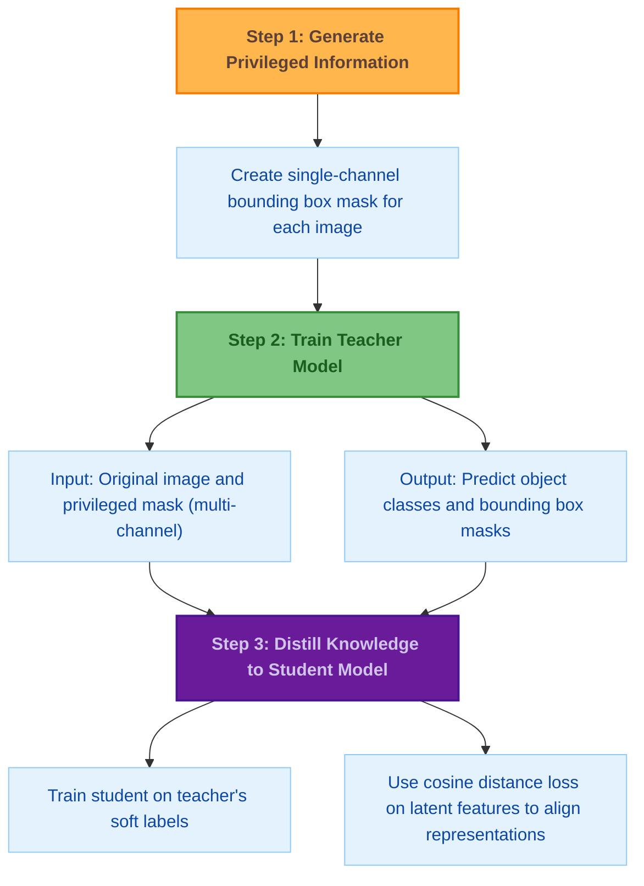

## 🎯 Contributions of This Research

- **Introducing LUPI to Object Detection**  
  This research demonstrates how integrating the Learning Using Privileged Information (LUPI) paradigm into object detection—particularly for litter detection—can enhance performance without changing the model architecture or affecting inference speed.

- **Enhanced Accuracy in Litter Detection and Localisation**  
  Results show significant improvements in detecting litter, especially smaller objects. The approach yields stronger gains in binary object localisation and also improves multi-label detection performance.

- **Model-Agnostic Improvements**  
  The approach works effectively across multiple detection models without increasing the number of parameters or inference time. While training time rises due to the teacher model, inference remains efficient during deployment.

- **Strong Generalization Across Litter Datasets**  
  Extensive testing confirms that the approach generalizes well within the primary litter detection dataset and across others, improving detection of small and partially occluded objects in varied scenarios.

- **Broader Impact on Object Detection Tasks**  
  Beyond litter detection, the technique enhances multi-label detection performance on general object detection datasets. However, accuracy tends to decrease as the number of object classes grows.


## 📈 Main Detection Results

<h3>🛩️ UAV-Based Litter Detection: Within-Dataset Evaluation</h3>


<h4>SODA: Small Objects at Different Altitudes (Low-Altitudes)</h4>


<p align='center'>
  
</p>

<div align='center'>
<details>
<summary style="cursor: pointer;"><b>Visual Results</b></summary>
<p align='center'>
<table align="center">
  <tr>
    <td align="center">
      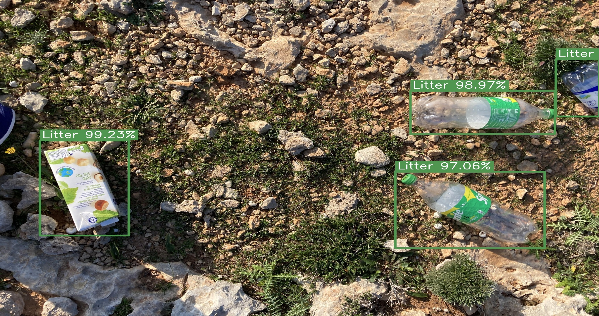
    </td>
    <td align="center">
      
    </td>
  </tr>
  <tr>
    <td align="center">
      <b>Baseline Results</b>
    </td>
    <td align="center">
      <b>Student Results (Ours)</b>
    </td>
</table>
</p>
</details>
</div>

<h4>SODA: Small Objects at Different Altitudes (All-Altitudes)</h4>


<p align='center'>
  
</p>

<div align='center'>
<details>
<summary style="cursor: pointer;"><b>Visual Results</b></summary>
<p align='center'>
<table align="center">
  <tr>
    <td align="center">
      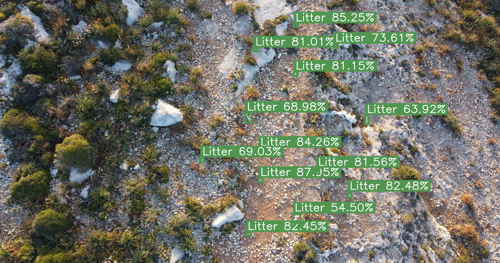
    </td>
    <td align="center">
      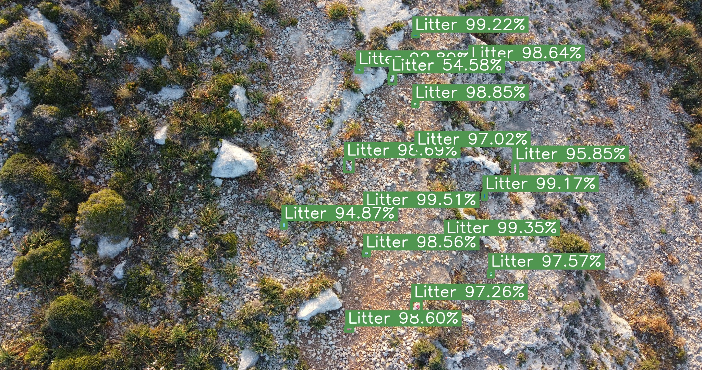
    </td>
  </tr>
  <tr>
    <td align="center">
      <b>Baseline Results</b>
    </td>
    <td align="center">
      <b>Student Results (Ours)</b>
    </td>
</table>
</p>
</details>
</div>

<hr>

<h3>🌍 UAV-Based Litter Detection: Across-Dataset Evaluation</h3>


<h4>BDW: Bottle Detection in the Wild Using Low-Altitude Unmanned Aerial Vehicles</h4>


<p align='center'>
  
</p>

<div align='center'>
<details>
<summary style="cursor: pointer;"><b>Visual Results</b></summary>
<p align='center'>
<table align="center">
  <tr>
    <td align="center">
      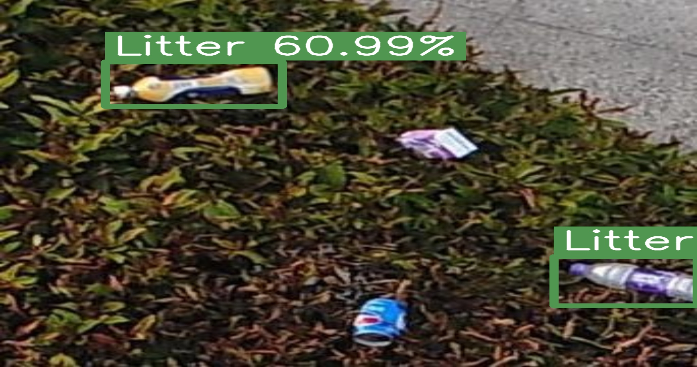
    </td>
    <td align="center">
      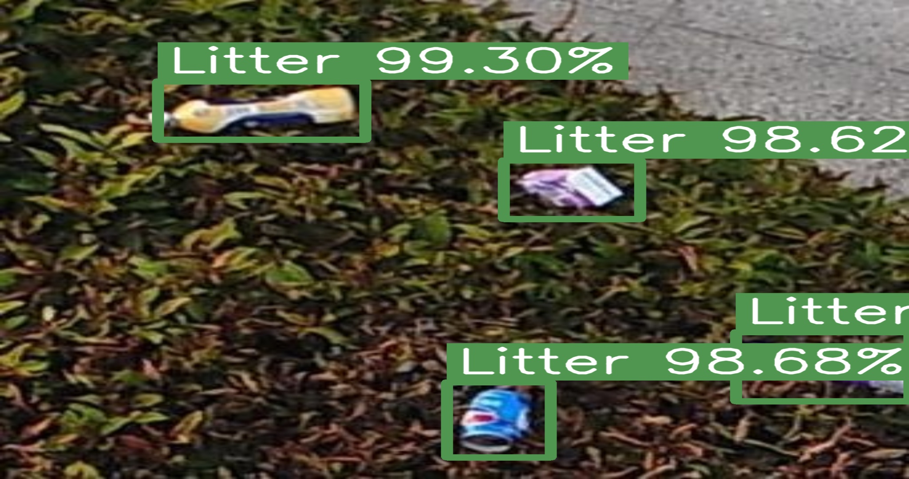
    </td>
  </tr>
  <tr>
    <td align="center">
      <b>Baseline Results</b>
    </td>
    <td align="center">
      <b>Student Results (Ours)</b>
    </td>
</table>
</p>
</details>
</div>

<h4>UAVVaste: Vision‐Based Trash and Litter Detection in Low Altitude Aerial Images</h4>

<p align='center'>
  
</p>

<div align='center'>
<details>
<summary style="cursor: pointer;"><b>Visual Results</b></summary>
<p align='center'>
<table align="center">
  <tr>
    <td align="center">
      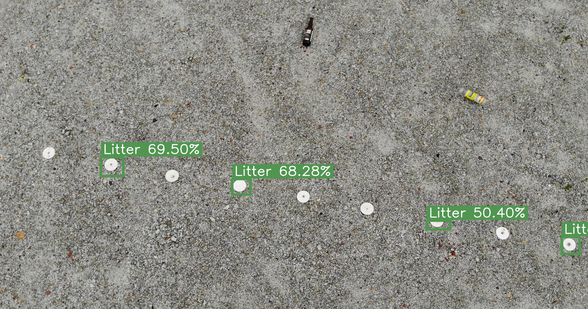
    </td>
    <td align="center">
      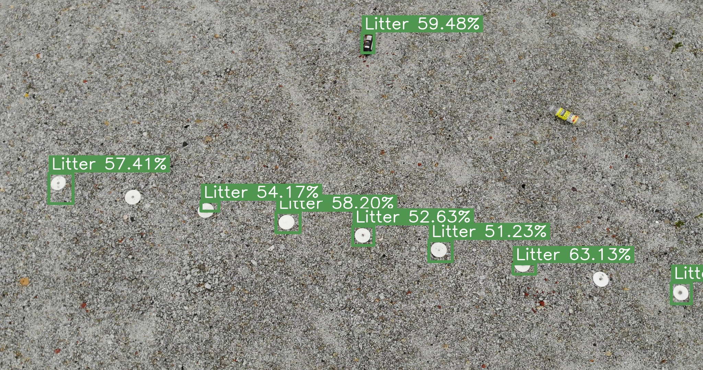
    </td>
  </tr>
  <tr>
    <td align="center">
      <b>Baseline Results</b>
    </td>
    <td align="center">
      <b>Student Results (Ours)</b>
    </td>
</table>
</p>
</details>
</div>

<hr>

<h3>🏷️ Multi-label Object Detection: Pascal VOC 2012 Evaluation</h3>


<p align='center'>
  
</p>

<p align='center'>
  
</p>

<div align='center'>
<details>
<summary style="cursor: pointer;"><b>Visual Results</b></summary>
<p align='center'>
<table align="center">
  <tr>
    <td align="center">
      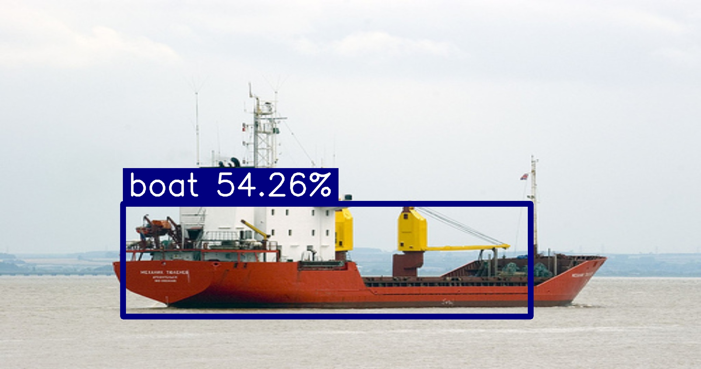
    </td>
    <td align="center">
      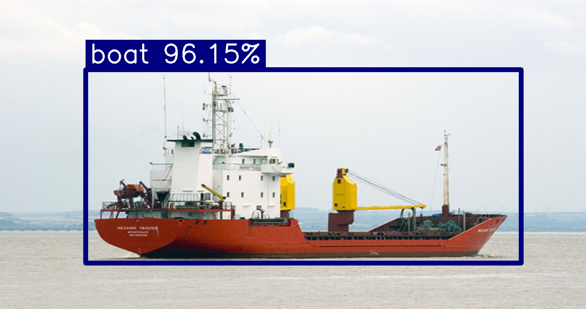
    </td>
  </tr>
  <tr>
    <td align="center">
      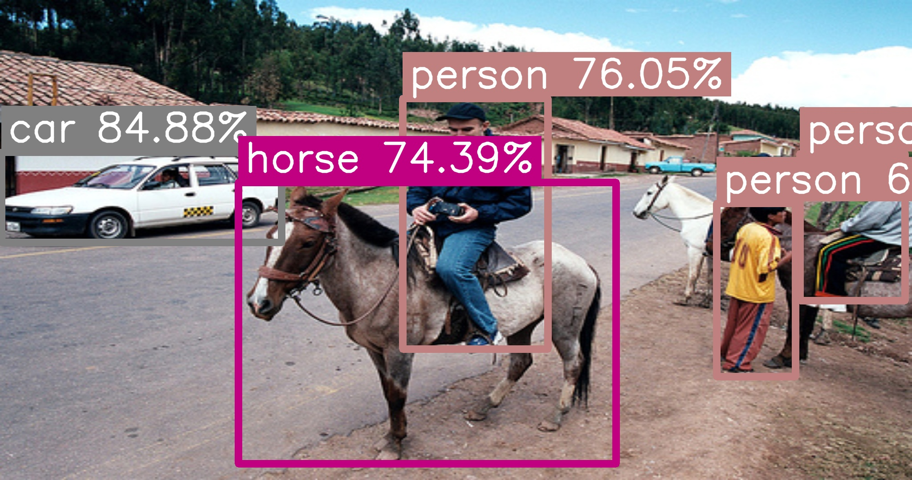
    </td>
    <td align="center">
      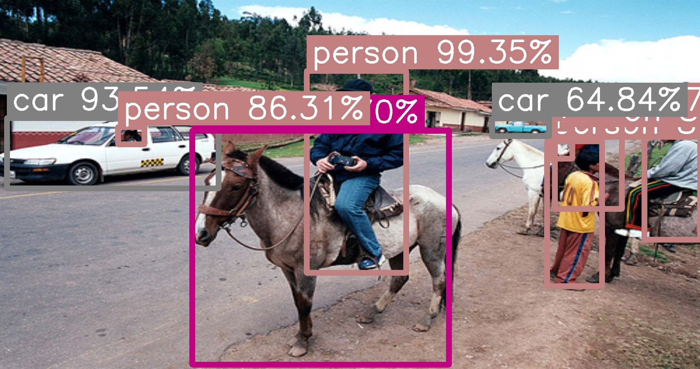
    </td>
  </tr>
  <tr>
    <td align="center">
      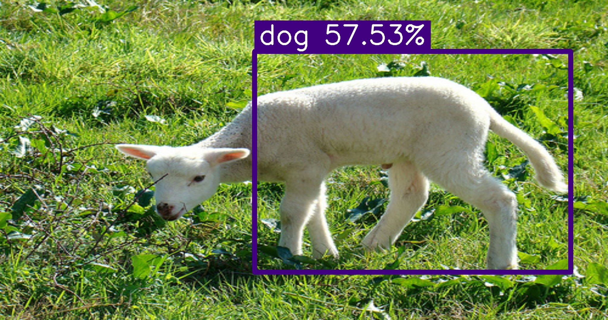
    </td>
    <td align="center">
      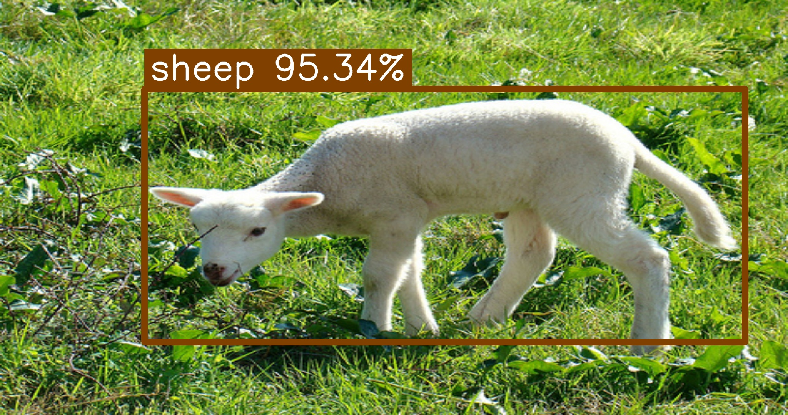
    </td>
  </tr>
  <tr>
    <td align="center">
      <b>Baseline Results</b>
    </td>
    <td align="center">
      <b>Student Results (Ours)</b>
    </td>
</table>
</p>
</details>
</div>

---

### 🧮 Model Size Comparison on Pascal VOC 2012

<div align="center">

| Model         | Config     | Size (MB) | Params (M) | Classes | Channels |
|---------------|------------|-----------|------------|---------|----------|
| **Faster R-CNN**  | Baseline   | 157.92    | 41.40      | 21      | 3        |
|                | **Student** | 157.92    | 41.40      | 21      | 3        |
| **RetinaNet**     | Baseline   | 124.22    | 32.56      | 21      | 3        |
|                | **Student** | 124.22    | 32.56      | 21      | 3        |
| **FCOS**          | Baseline   | 122.48    | 32.11      | 21      | 3        |
|                | **Student** | 122.48    | 32.11      | 21      | 3        |
| **SSD**           | Baseline   | 100.27    | 26.29      | 21      | 3        |
|                | **Student** | 100.27    | 26.29      | 21      | 3        |
| **SSD Lite**      | Baseline   | 9.42      | 2.47       | 21      | 3        |
|                | **Student** | 9.42      | 2.47       | 21      | 3        |

</div>


## 🔍 Other Detection Results

### 🛠️ Preliminary Experiment for Privileged Information Selection

<p align='center'>
  
  <br>
  <b>Explored Privileged Information Channels</b>
</p>

<p align='center'>
  
  <br>
  <b>Preliminary Experiment Results</b>
</p>

---

### 📊 Teacher Model Performance on Pascal VOC 2012

All results shown below reflect the performance of **teacher models** across key object detection metrics:

<div align='center'>


| Model               | mAP@50-95 | mAP@50 | mAP@75 | mAR@1 | mAR@10 | mAR@100 | Precision | Recall | F1 Score |
|---------------------|-----------|--------|--------|-------|--------|---------|-----------|--------|----------|
| RetinaNet           | 0.77      | 0.86   | 0.79   | 0.60  | 0.81   | 0.81    | 0.26      | 0.90   | 0.38     |
| FCOS 🥈              | 0.80      | 0.88   | 0.82   | 0.61  | 0.84   | 0.84    | 0.43      | 0.91   | **0.56** |
| Faster R-CNN 🥇      | 0.77      | 0.91   | 0.82   | 0.59  | 0.82   | 0.82    | 0.56      | 0.91   | **0.68** |
| SSD                 | 0.42      | 0.56   | 0.49   | 0.41  | 0.48   | 0.48    | 0.25      | 0.69   | 0.36     |
| SSDLite            | 0.49      | 0.61   | 0.54   | 0.46  | 0.55   | 0.55    | 0.04      | 0.79   | 0.07     |

</div>

## 💾 Installation

### Prerequisites

```bash
Python 3.9+
CUDA-capable GPU (recommended)
```

### Clone the Repository

```bash
git clone https://github.com/mbar0075/lupi-for-object-detection.git
cd lupi-for-object-detection
pip install -r requirements.txt
```

## 🎓 About This Research

This research was carried out at the [University of Malta](https://www.um.edu.mt) and submitted in partial fulfilment of the requirements for the Master of Science Degree by Research. It was supervised by [Dr. Dylan Seychell](https://www.um.edu.mt/profile/dylanseychell) and [Dr. Konstantinos Makantasis](https://www.um.edu.mt/profile/konstantinosmakantasis). The full master’s dissertation, which includes the research question, background, methodology, evaluation, and analysis, can be downloaded below.

<div align="center">

📄 **[Download PDF](./Latex/Matthias_Bartolo_Masters_2025.pdf)**

</div>

<h2> 📘 Citation</h2>

### 🎓 Dissertation
```bibtex
@mastersthesis{bartolo2025privilegedinfo,
  title={Investigating the Role of Learning using Privileged Information in Object Detection},
  author={Bartolo, Matthias},
  type={{M.Sc.} thesis},
  year={2025},
  school={University of Malta}
}
```

<!--

```bibtex
``` -->

## 🪪 License

This project is licensed under the MIT License. See the [LICENSE](LICENSE) file for details.

## ✉️ Contact

For questions, collaboration, or feedback, please contact [Matthias Bartolo](mailto:matthias.bartolo@um.edu.mt)